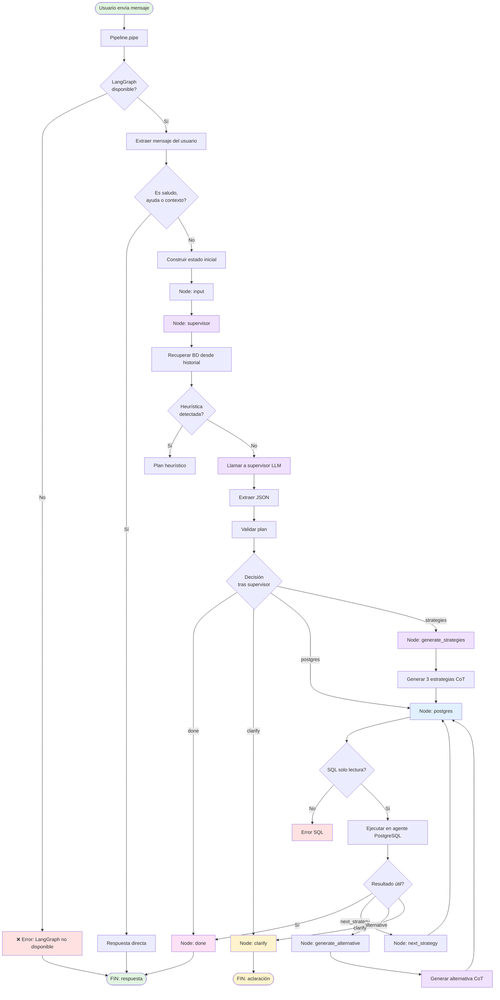

```mermaid
flowchart TD
    Start([Usuario envía mensaje]) --> Pipeline[Pipeline.pipe]
    Pipeline --> CheckLangGraph{LangGraph<br/>disponible?}
    CheckLangGraph -->|No| ErrorLG[❌ Error: LangGraph no disponible]
    CheckLangGraph -->|Sí| ExtractMsg[Extraer mensaje del usuario]
    ExtractMsg --> CheckSpecial{Es saludo,<br/>ayuda o contexto?}
    CheckSpecial -->|Sí| DirectResponse[Respuesta directa]
    CheckSpecial -->|No| BuildState[Construir estado inicial]
    BuildState --> NodeInput[Node: input]
    NodeInput --> NodeSupervisor[Node: supervisor]

    NodeSupervisor --> RecoverContext[Recuperar BD desde historial]
    RecoverContext --> DetectHeuristic{Heurística<br/>detectada?}
    DetectHeuristic -->|Sí| PlanHeuristic[Plan heurístico]
    DetectHeuristic -->|No| CallSupervisorLLM[Llamar a supervisor LLM]
    CallSupervisorLLM --> ParseSupervisor[Extraer JSON]
    ParseSupervisor --> ValidatePlan[Validar plan]

    ValidatePlan --> RouteDecision{Decisión<br/>tras supervisor}
    RouteDecision -->|done| NodeDone[Node: done]
    RouteDecision -->|clarify| NodeClarify[Node: clarify]
    RouteDecision -->|postgres| NodePostgres[Node: postgres]
    RouteDecision -->|strategies| NodeStrategies[Node: generate_strategies]

    NodeStrategies --> StrategyLLM[Generar 3 estrategias CoT]
    StrategyLLM --> NodePostgres

    NodePostgres --> CheckReadonly{SQL solo lectura?}
    CheckReadonly -->|No| PostgresError[Error SQL]
    CheckReadonly -->|Sí| ExecuteSQL[Ejecutar en agente PostgreSQL]

    ExecuteSQL --> EvalPostgres{Resultado útil?}
    EvalPostgres -->|Sí| NodeDone
    EvalPostgres -->|next_strategy| NodeNextStrategy[Node: next_strategy]
    EvalPostgres -->|alternative| NodeAlternative[Node: generate_alternative]
    EvalPostgres -->|clarify| NodeClarify

    NodeNextStrategy --> NodePostgres
    NodeAlternative --> AltLLM[Generar alternativa CoT]
    AltLLM --> NodePostgres

    NodeClarify --> EndClarify([FIN: aclaración])
    NodeDone --> EndDone([FIN: respuesta])

    ErrorLG --> EndDone
    DirectResponse --> EndDone

    style Start fill:#e1f5e1
    style EndDone fill:#e1f5e1
    style EndClarify fill:#fff3cd
    style ErrorLG fill:#ffe1e1
    style PostgresError fill:#ffe1e1
    style NodeSupervisor fill:#f0e1ff
    style CallSupervisorLLM fill:#f0e1ff
    style NodeStrategies fill:#f0e1ff
    style AltLLM fill:#f0e1ff
    style NodePostgres fill:#e1f0ff
    style NodeDone fill:#ffe1f5
    style NodeClarify fill:#fff3cd
```
