# Caso 4 - LLM implementado en forma de supervisor, el cual dispone de agentes para cada base de datos existente y que permite conversaciones con lenguaje natural con el usuario

## Objetivo
Lograr que el usuario, mediante lenguaje natural, pueda interactuar con este modelo para obtener informaciòn sobre las bases de datos existentes y que el modelo pueda usar un razonamiento estructurado en LangGraph para poder procesar esta consulta, a través del uso de agentes especializados en cada base de datos presente.

## Componentes
- OpenWebUI (frontend)
- OpenWebUI Pipelines
- Ollama: llama3:latest
- PostgreSQL: sí
- LangGraph/LangChain: sí

## Componentes LangGraph utilizados

---

### **StateGraph**

```python
g = StateGraph(AgentState)
```

#### Función

* Define el grafo de estados del agente
* Es la estructura central donde se declaran nodos, transiciones y estado compartido
* Permite modelar el flujo de razonamiento como un proceso explícito y controlado
* Es el motor de orquestación del sistema, formaliza el razonamiento del modelo
* Permite separar decisiones, ejecución de herramientas y generación de respuesta

---

### **AgentState**

```python
class AgentState(TypedDict, total=False):
    user_text: str
    plan: dict
    route: str
    db_result: dict
    answer: str
```

#### Función

* Define la memoria compartida entre nodos
* Cada nodo puede leer y modificar partes del estado
* Hace explícito el estado cognitivo del sistema en cada paso
* Es la memoria de trabajo del agente, permite trazabilidad del razonamiento
* Facilita depuración y análisis del flujo

---

### **Nodos (add_node)**

```python
g.add_node("input", node_input)
g.add_node("supervisor", node_supervisor)
g.add_node("postgres_agent", node_postgres_agent)
g.add_node("done", node_done)
```

#### Función

* Cada nodo encapsula una unidad funcional del sistema
* Separan claramente:

  * Interpretación
  * Planificación
  * Ejecución
  * Respuesta

---

### **Supervisor LLM**

El supervisor utiliza un modelo (Ollama + Llama3) con un prompt estructurado que obliga a devolver un JSON con el siguiente esquema:

```json
{
  "route": "...",
  "action": "query | answer",
  "sql": "...",
  "answer": "..."
}
```

#### Función

* Actúa como cerebro estratégico o supervisor, está encargado de la planificación del razonamiento
* Decide qué agente especializado debe actuar
* No ejecuta directamente herramientas
* No accede directamente a bases de datos
* Separa planificación de ejecución
* Implementa una arquitectura de tipo supervisor-worker

---

### **Agentes especializados por base de datos**

Cada base de datos PostgreSQL tiene una instancia:

```python
PostgresSafeAgent(route="pg_ncorrea", dbname="ncorrea")
PostgresSafeAgent(route="pg_enel", dbname="enel")
...
```

#### Función

* Ejecutar consultas únicamente en su base de datos asignada
* Validar que el SQL sea de solo lectura
* Forzar límites de seguridad
* Conectar en modo `readonly`
* Registrar métricas

#### Qué representan en el sistema

* Agentes especializados por familia de datos
* Permiten tener modularidad y escalabilidad
* Permiten la separación de responsabilidades

---

### **Transiciones condicionales**

```python
g.add_conditional_edges("supervisor", route_function, {...})
```

#### Función

* Implementan el razonamiento como decisión de ruta
* El flujo cambia dinámicamente según el `route` decidido por el supervisor
* Permiten arquitectura multi-agente
* El sistema no es lineal, es un grafo dinámico controlado por decisión cognitiva

---

### **Transiciones secuenciales**

```python
g.add_edge("postgres_agent", "done")
```

#### Función

* Definen el flujo tras una decisión
* Permiten encadenar ejecución con respuesta

---

### **Estado final (END)**

```python
from langgraph.graph import END
g.add_edge("done", END)
```

#### Función

* Marca el final del razonamiento
* El sistema devuelve una respuesta estructurada compatible con OpenAI API

---

### **Compilación del grafo**

```python
GRAPH = g.compile()
```

#### Función

* Convierte la definición declarativa en un ejecutable
* Permite invocar el agente con:

```python
GRAPH.invoke({...})
```

---

## Seguridad en la ejecución SQL

El sistema implementa múltiples capas de protección:

* Validación por regex (bloqueo de INSERT/UPDATE/DELETE/etc.)
* Validación del primer token SQL
* Forzado de `LIMIT`
* Conexión en modo `readonly`
* Usuario PostgreSQL con permisos restringidos
* Timeout de conexión
* Límite máximo de filas
* Recorte de salida excesiva

Esto evita que el LLM pueda ejecutar operaciones destructivas.

---

## Flujo general del sistema

```text
Usuario
   ↓
OpenWebUI
   ↓
Pipeline
   ↓
LangGraph
   ↓
Supervisor (LLM)
   ↓
Agente PostgreSQL especializado
   ↓
Base de Datos
   ↓
Respuesta formateada
   ↓
Usuario
```

---

## Flujo representado en Mermaid

```mermaid
flowchart TD
    Start([Usuario envía mensaje]) --> Pipeline[Pipeline.pipe]
    Pipeline --> CheckLangGraph{LangGraph<br/>disponible?}
    CheckLangGraph -->|No| ErrorLG[❌ Error: LangGraph no disponible]
    CheckLangGraph -->|Sí| ExtractMsg[Extraer mensaje del usuario]
    ExtractMsg --> CheckGreeting{Es saludo<br/>o ayuda?}
    CheckGreeting -->|Sí| DirectResponse[Respuesta directa amigable]
    CheckGreeting -->|No| StartGraph[Iniciar LangGraph]
    StartGraph --> NodeInput[Node: Input<br/>Recibe estado inicial]
    NodeInput --> NodeSupervisor[Node: Supervisor<br/>Analiza la solicitud]
    NodeSupervisor --> QuickDetect{Pregunta sobre<br/>BDs disponibles?}
    QuickDetect -->|Sí| QuickAnswer[Respuesta directa<br/>con lista de BDs]
    QuickDetect -->|No| CallOllama[Llamar a Ollama LLM]
    CallOllama --> RetryLoop{Reintentos<br/>< MAX_RETRIES?}
    RetryLoop -->|No| Fallback[Plan fallback:<br/>route=direct, mensaje de ayuda]
    RetryLoop -->|Sí| PostOllama[POST a /api/generate]
    PostOllama --> ParseResponse{Respuesta<br/>HTTP 200?}
    ParseResponse -->|No| RetryLoop
    ParseResponse -->|Sí| ExtractJSON[Extraer objeto JSON<br/>de la respuesta]
    ExtractJSON --> ValidJSON{JSON<br/>válido?}
    ValidJSON -->|No| RetryLoop
    ValidJSON -->|Sí| FixErrors[Corregir errores comunes<br/>ej: pg_direct → direct]
    FixErrors --> ValidatePlan[Validar plan]
    ValidatePlan --> PlanValid{Plan<br/>válido?}
    PlanValid -->|No| InvalidPlan[Plan inválido:<br/>route=direct con mensaje de ayuda]
    PlanValid -->|Sí| SetRoute[Establecer route en el estado]
    QuickAnswer --> SetRoute
    Fallback --> SetRoute
    InvalidPlan --> SetRoute
    SetRoute --> RouteDecision{route en<br/>AGENTS?}
    RouteDecision -->|No - direct| NodeDone[Node: Done<br/>Preparar respuesta final]
    RouteDecision -->|Sí - pg_*| NodePostgres[Node: Postgres Agent<br/>Ejecutar consulta SQL]
    NodePostgres --> CheckPsycopg2{psycopg2<br/>disponible?}
    CheckPsycopg2 -->|No| DBError1[Error: psycopg2 no disponible]
    CheckPsycopg2 -->|Sí| CheckReadOnly{SQL es<br/>solo lectura?}
    CheckReadOnly -->|No| DBError2[Error: SQL no permitido<br/>solo SELECT/WITH]
    CheckReadOnly -->|Sí| NormalizeSQL[Normalizar SQL<br/>agregar/validar LIMIT]
    NormalizeSQL --> ConnectDB[Conectar a PostgreSQL<br/>readonly mode]
    ConnectDB --> ExecuteSQL{Ejecución<br/>exitosa?}
    ExecuteSQL -->|No| DBError3[Error de ejecución SQL]
    ExecuteSQL -->|Sí| FetchRows[Obtener filas<br/>máximo MAX_LIMIT]
    FetchRows --> CloseConn[Cerrar conexión]
    CloseConn --> DBSuccess[Resultado exitoso<br/>con filas]
    DBError1 --> NodeDone
    DBError2 --> NodeDone
    DBError3 --> NodeDone
    DBSuccess --> NodeDone
    NodeDone --> CheckRoute{Tipo de<br/>respuesta?}
    CheckRoute -->|direct| FormatDirect[Formatear respuesta<br/>conversacional]
    CheckRoute -->|query exitosa| FormatSuccess[Formatear resultado SQL<br/> con tabla y stats]
    CheckRoute -->|query error| FormatError[Formatear mensaje error<br/> con detalles]
    CheckRoute -->|query sin filas| FormatEmpty[Formatear mensaje<br/> sin resultados]
    FormatDirect --> PrepareOutput[Preparar output final]
    FormatSuccess --> PrepareOutput
    FormatError --> PrepareOutput
    FormatEmpty --> PrepareOutput
    DirectResponse --> PrepareOutput
    ErrorLG --> PrepareOutput
    PrepareOutput --> StreamMode{Modo<br/>stream?}
    StreamMode -->|Sí| SSEStream[Generar SSE chunks<br/>data: JSON]
    StreamMode -->|No| NonStream[Generar respuesta completa<br/>JSON]
    SSEStream --> Return([Retornar al usuario])
    NonStream --> Return
    style Start fill:#e1f5e1
    style Return fill:#e1f5e1
    style ErrorLG fill:#ffe1e1
    style DBError1 fill:#ffe1e1
    style DBError2 fill:#ffe1e1
    style DBError3 fill:#ffe1e1
    style FormatError fill:#ffe1e1
    style DBSuccess fill:#e1f0ff
    style FormatSuccess fill:#e1f0ff
    style DirectResponse fill:#fff9e1
    style QuickAnswer fill:#fff9e1
    style CallOllama fill:#f0e1ff
    style NodeSupervisor fill:#f0e1ff
    style NodePostgres fill:#e1f0ff
    style NodeDone fill:#ffe1f5
```



