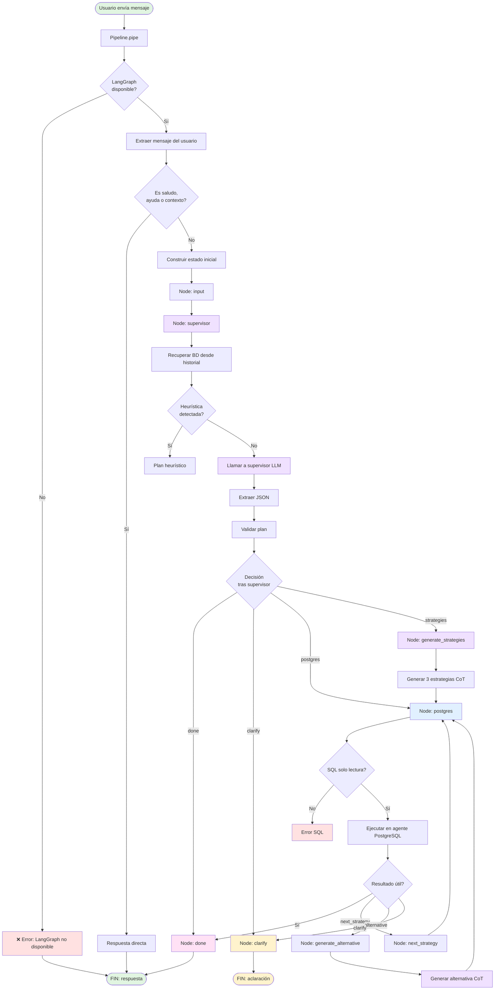

---

# Caso - LLM implementado en forma de supervisor, con agentes especializados por base de datos y razonamiento estructurado mediante LangGraph + CoT (Chain of Thought)

## Objetivo

Lograr que el usuario, mediante lenguaje natural, pueda interactuar con múltiples bases de datos PostgreSQL desde una única interfaz, permitiendo que el sistema seleccione automáticamente qué agente especializado debe actuar según la intención detectada. El modelo utiliza una arquitectura supervisor-worker, donde el LLM planifica, LangGraph orquesta el flujo y cada agente de base de datos ejecuta únicamente consultas sobre su BD asignada. Además, se añade una capa de razonamiento estructurado basada en CoT para mejorar el comportamiento ante consultas ambiguas, reintentos, validación y aclaraciones. 

## Componentes

* OpenWebUI (frontend)
* OpenWebUI Pipelines
* Ollama: `llama3:latest`
* PostgreSQL: sí
* LangGraph/LangChain: sí
* Psycopg2: sí
* Logging estructurado y registro en archivo: sí 

## Componentes LangGraph utilizados

---

### **StateGraph**

```python
g = StateGraph(AgentState)
```

#### Función

* Define el grafo de estados del agente
* Es la estructura central donde se declaran nodos, transiciones y estado compartido
* Permite modelar el flujo de razonamiento como un proceso explícito y controlado
* Actúa como motor de orquestación del sistema
* Formaliza la separación entre interpretación, planificación, ejecución, validación y respuesta final 

---

### **AgentState**

```python
class AgentState(TypedDict, total=False):
    user_text: str
    conversation_id: str
    messages_history: list
    route: str
    plan: Dict[str, Any]
    db: Dict[str, Any]
    answer: str
    retry_count: int
    use_multi_strategy: bool
    strategies: List[Dict[str, Any]]
    strategy_index: int
    needs_clarification: bool
    clarification_question: str
```

#### Función

* Define la memoria compartida entre nodos
* Cada nodo puede leer y modificar partes del estado
* Hace explícito el estado cognitivo del sistema en cada paso
* Facilita trazabilidad, depuración y análisis del flujo del agente 
* Contiene no solo el plan y el resultado SQL, sino también:

  * contexto conversacional
  * historial de mensajes
  * contador de reintentos
  * estrategias CoT
  * estado de aclaración

---

### **Nodos (add_node)**

```python
g.add_node("input", node_input)
g.add_node("supervisor", node_supervisor)
g.add_node("generate_strategies", node_generate_strategies)
g.add_node("postgres", node_postgres_agent)
g.add_node("next_strategy", node_next_strategy)
g.add_node("generate_alternative", node_generate_alternative)
g.add_node("clarify", node_clarify)
g.add_node("done", node_done)
```

#### Función

* Cada nodo encapsula una unidad funcional del sistema
* Separan claramente:

  * recepción del estado
  * planificación supervisada
  * generación de estrategias CoT
  * ejecución sobre PostgreSQL
  * cambio de estrategia
  * generación de alternativa
  * aclaración al usuario
  * construcción de la respuesta final

#### Descripciones de los nodos

* `input`: entrada del estado inicial
* `supervisor`: interpreta la consulta y decide el plan
* `generate_strategies`: genera varias estrategias cuando la consulta es ambigua
* `postgres`: ejecuta el SQL en el agente PostgreSQL correspondiente
* `next_strategy`: cambia a la siguiente estrategia CoT
* `generate_alternative`: replanifica cuando falla una consulta
* `clarify`: formula una repregunta automática
* `done`: construye la salida final compatible con OpenWebUI 

---

### **Supervisor LLM**

El supervisor utiliza un modelo local (`Ollama + llama3`) con un prompt estructurado que obliga a devolver un JSON con el siguiente esquema:

```json
{
  "route": "...",
  "action": "query | answer",
  "sql": "...",
  "answer": "..."
}
```

#### Función

* Actúa como cerebro estratégico
* Decide qué agente especializado debe actuar
* Elige la ruta (`route`) correspondiente a una base de datos concreta
* Decide si la respuesta debe ser directa o si debe generarse una consulta SQL
* No ejecuta directamente herramientas
* No accede directamente a bases de datos
* Implementa una arquitectura supervisor-worker
* Se apoya primero en heurísticas y, cuando estas no son suficientes, utiliza el LLM para generar el plan estructurado 

---

### **Capa heurística previa al supervisor**

Antes de delegar en el LLM, el sistema intenta reconocer patrones frecuentes del usuario.

#### Ejemplos de patrones detectados

* “N registros de X”
* “registros de X”
* “datos de X”
* “columnas de X”
* “muéstrame las tablas”
* “usa [base de datos]”

#### Función

* Reducir dependencia del LLM en consultas simples
* Hacer más robusto el sistema ante preguntas frecuentes
* Mejorar precisión en consultas directas a tablas
* Preservar una planificación determinista cuando el patrón es claro 

---

### **CoT (Chain of Thought) como añadido al supervisor**

El CoT no sustituye la arquitectura supervisor-agentes, sino que la complementa.

#### Componentes CoT principales

```python
generate_cot_strategies(...)
validate_result(...)
generate_alternative(...)
```

#### Función

* Generar múltiples estrategias SQL alternativas
* Evaluar cuál tiene más sentido para la pregunta del usuario
* Reintentar cuando una estrategia falla
* Validar si el resultado obtenido realmente responde a la intención del usuario
* Introducir una capa de razonamiento estructurado adicional sin romper la arquitectura base

---

### **Agentes especializados por base de datos**

Cada base de datos PostgreSQL tiene una instancia especializada dentro del diccionario `AGENTS`:

```python
AGENTS[db_to_route(db)] = PostgresSafeAgent(route=db_to_route(db), dbname=db)
```

#### Función

* Ejecutar consultas únicamente en su base de datos asignada
* Aislar responsabilidades por base de datos
* Impedir que una consulta diseñada para una BD se ejecute sobre otra incorrecta
* Validar que el SQL sea de solo lectura
* Forzar límites de seguridad
* Conectar en modo `readonly`
* Registrar métricas de ejecución
* Separación clara entre planificación y ejecución
* Posibilidad de ampliar el sistema añadiendo nuevas bases de datos sin rediseñar la arquitectura central 

---

### **PostgresSafeAgent**

```python
class PostgresSafeAgent:
    def __init__(self, route: str, dbname: str):
        ...
```

#### Función

* Ejecuta la consulta SQL normalizada
* Comprueba que la sentencia sea de solo lectura
* Añade `LIMIT` automáticamente cuando corresponde
* Abre conexión segura a PostgreSQL
* Devuelve filas estructuradas para su posterior formateo
* Captura errores y los devuelve como parte del estado del grafo 

---

### **Transiciones condicionales**

```python
g.add_conditional_edges("supervisor", decide_after_supervisor, {...})
g.add_conditional_edges("postgres", should_after_postgres, {...})
```

#### Función

* Implementan el razonamiento como decisiones de ruta
* El flujo cambia dinámicamente según:

  * si el supervisor devuelve respuesta directa
  * si conviene ejecutar SQL o usar las heurísticas
  * si hay que activar estrategias CoT
  * si hace falta cambiar de estrategia
  * si hay que generar una alternativa o es necesario pedir una aclaración

* Convierten el sistema en un grafo dinámico y no lineal 

---

### **Transiciones secuenciales**

```python
g.add_edge("input", "supervisor")
g.add_edge("generate_strategies", "postgres")
g.add_edge("next_strategy", "postgres")
g.add_edge("generate_alternative", "postgres")
```

#### Función

* Definen el flujo directo entre fases
* Permiten encadenar planificación, ejecución, reintento y respuesta
* Mantienen el flujo ordenado dentro de una lógica multiagente controlada 

---

### **Estado final (END)**

```python
from langgraph.graph import END
g.add_edge("clarify", END)
g.add_edge("done", END)
```

#### Función

* Marca el final del razonamiento
* El sistema termina bien con:

  * una respuesta final
  * o una repregunta automática de aclaración
* Devuelve una respuesta estructurada compatible con el API de OpenAI

---

### **Compilación del grafo**

```python
GRAPH = build_graph()
```

#### Función

* Convierte la definición declarativa del flujo en un ejecutable
* Permite invocar el sistema con:

```python
GRAPH.invoke({...})
```

* Hace operativo el razonamiento definido en nodos y transiciones 

---

## Seguridad en la ejecución SQL

El sistema implementa múltiples capas de protección:

* Validación por regex para bloquear `INSERT`, `UPDATE`, `DELETE`, `DROP`, `ALTER`, etc.
* Validación del primer token SQL
* Restricción a consultas `SELECT` o `WITH`
* Forzado de `LIMIT`
* Normalización del límite máximo permitido
* Conexión PostgreSQL en modo `readonly`
* Timeout de conexión
* Límite máximo de filas devueltas
* Recorte de salida excesiva
* Validación previa del plan antes de ejecutarlo

Esto evita que el LLM pueda ejecutar operaciones destructivas o salirse del marco de solo lectura. 

---

## Manejo del contexto conversacional

El sistema conserva contexto sobre la base de datos activa:

* usa `CONVERSATION_CONTEXT`
* detecta comandos como “usa X”, “cambia a X”, “ve a X”
* además reconstruye la BD activa desde el historial de mensajes mediante `extract_db_from_history()`

#### Función

* Mantener conversaciones coherentes de múltiples turnos (pregunta y repregunta)
* Permitir que el usuario cambie de base de datos sin repetir el contexto en cada mensaje
* Hacer el sistema más robusto ante múltiples workers o reinicios parciales del pipeline 

---

## Flujo general del sistema

```text
Usuario
   ↓
OpenWebUI
   ↓
Pipeline
   ↓
LangGraph
   ↓
Supervisor (LLM + heurísticas)
   ↓
Selección de route
   ↓
Agente PostgreSQL especializado
   ↓
Base de Datos
   ↓
Validación / reintento / aclaración
   ↓
Respuesta formateada
   ↓
Usuario
```

---

## Flujo representado en Mermaid



---


