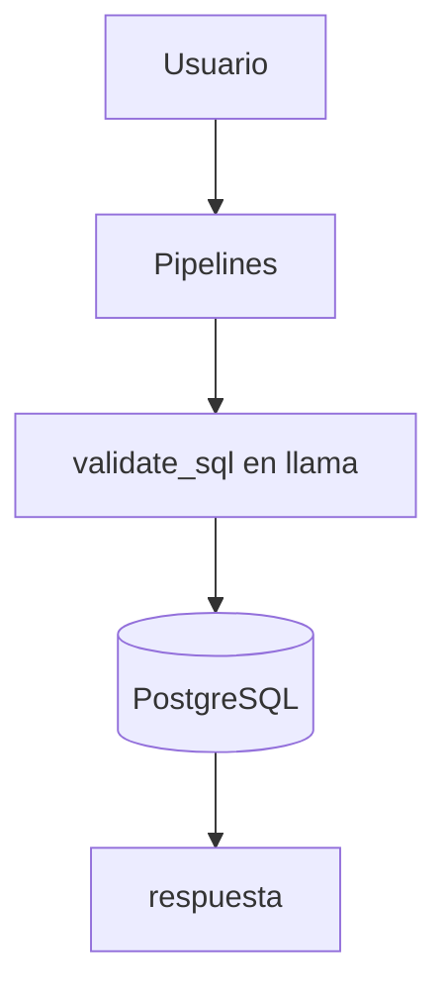

# Ejemplo 1 — Consulta libre con lenguaje natural sobre la estructura de la base de datos

## Objetivo
Que un usuario pueda conocer la estructura de la base de datos de una manera rápida y ordenada usando lenguaje natural.

## Componentes
- OpenWebUI (frontend)
- OpenWebUI Pipelines
- Ollama: llama3:latest
- PostgreSQL: sí (en específico estamos en la base de datos de ncorrea, se puede modificar)
- LangGraph/LangChain: no

## Flujo de razonamiento

