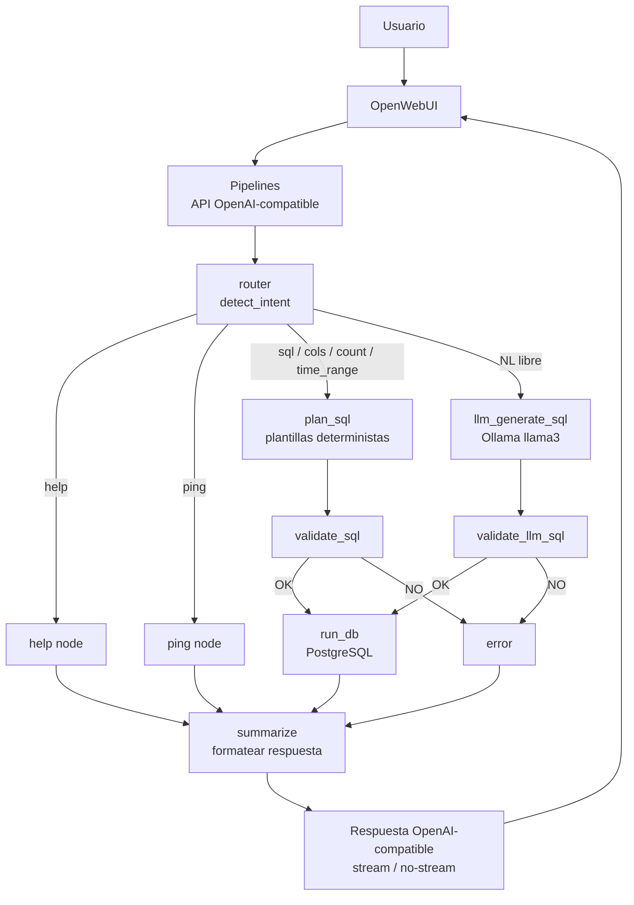

# Caso 3 - Agente que permite conversaciones tanto en lenguaje natural como usando consultas estructuradas sobre la base de datos, basándose en usar componentes de LangGraph

## Objetivo
Lograr que el usuario, mediante lenguaje natural, pueda interactuar con OpenWebUI para obtener informaciòn sobre la base de datos y que el modelo pueda usar un razonamiento estructurado en LangGraph para poder procesar esta consulta.

## Componentes
- OpenWebUI (frontend)
- OpenWebUI Pipelines
- Ollama: llama3:latest
- PostgreSQL: sí
- LangGraph/LangChain: sí

### Componentes LangGraph utilizados

**StateGraph**

```text
g = StateGraph(AgentState)
```

Función: 
- Define el grafo de estados del agente
- Es la estructura central donde se declaran nodos, transiciones y estado compartido

Qué representa conceptualmente:

- El “cerebro” del agente, se busca trabajar un modelo explícito de razonamiento

**AgentState**

```text
class AgentState(TypedDict, total=False):
    user_text: str
    intent: ...
    table: str
    sql: str
    db_result: dict
    answer: str
```

Función:

- Define la memoria compartida entre nodos
- Cada nodo lee y escribe partes del estado
- Hace explícito el estado cognitivo del agente
- Facilita trazabilidad y depuración

**Nodos (add_node)**

```text
g.add_node("router", node_router)
g.add_node("plan_sql", node_plan_sql)
g.add_node("run_db", node_run_db)
g.add_node("summarize", node_summarize)
g.add_node("llm_generate_sql", node_llm_generate_sql)
g.add_node("validate_llm_sql", node_validate_llm_sql)
```

Función:

- Cada nodo es una unidad funcional del razonamiento
- Encapsulan decisiones o acciones concretas

Ejemplos:

- router: interpreta intención
- plan_sql: genera SQL
- run_db: ejecuta tool
- summarize: genera respuesta final

**Punto de entrada (set_entry_point)**

```text
g.set_entry_point("router")
```

Función:

- Define dónde comienza el razonamiento del agente
- Siempre se inicia analizando la intención del usuario

**Transiciones condicionales (add_conditional_edges)**

```text
g.add_conditional_edges("router", route_from_router, {...})
```

Función:

- Implementa razonamiento como decisión de ruta
- El flujo cambia según el estado (intent)
- Dada una intención, el agente decide qué camino seguir

**Transiciones normales (add_edge)**

```text
g.add_edge("plan_sql", "run_db")
g.add_edge("run_db", "summarize")
```

Función:

- Define el flujo secuencial tras una decisión

**Nodo LLM (llm_generate_sql)**

```text
g.add_node("llm_generate_sql", node_llm_generate_sql)
```

Función:

- Introduce al LLM como herramienta cognitiva
- Convierte lenguaje natural libre en SQL
- El LLM no decide el flujo actualmente
- El LLM no ejecuta tools actualmente
- El LLM no controla el agente actualmente
- El LLM solo genera contenido cuando el grafo lo decide

**Nodo de validación (validate_llm_sql)**

```text
g.add_node("validate_llm_sql", node_validate_llm_sql)
```

Función:

- Actúa como “filtro cognitivo” para corroborar la efectividad del output del LLM
- Verifica que el output del LLM cumple reglas de seguridad
- Evita alucinaciones
- Separa generación de outputs de la ejecución del comando SQL en la base de datos


**Estado final (END)**

```text
from langgraph.graph import END
g.add_edge("summarize", END)
```

Función

- Marca el final del razonamiento
- El agente devuelve una respuesta y termina el flujo de razonamiento


**Compilación del grafo (compile)**

```text
GRAPH = g.compile()
```

Función

- Convierte el grafo declarativo en un ejecutable
- Permite invocar el agente con GRAPH.invoke()


## Flujo de razonamiento (resumen)


