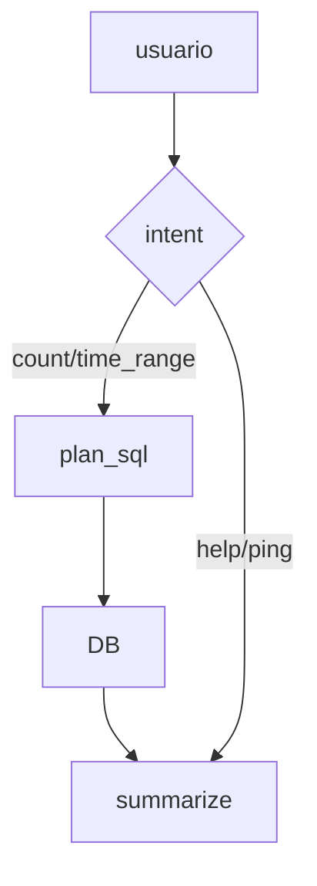

# Caso 2 — Conversación usando consultas estructuradas en SQL

## Objetivo
Lograr que el usuario pueda ejecutar queries específicas sobre la base de datos mediante la interacción con OpenWebUI.

## Componentes
- OpenWebUI (frontend)
- OpenWebUI Pipelines
- Ollama: no aplica, esta pipeline solo se enfoca en procesar consultas en formato SQL
- PostgreSQL: sí
- LangGraph/LangChain: sí, el modelo basa su funcionamiento en nodos de langGraph

### Componentes LangGraph utilizados

- StateGraph
g = StateGraph(AgentState)

Función: 
-Define el grafo de estados del agente.
-Es la estructura central donde se declaran nodos, transiciones y estado compartido.

Qué representa conceptualmente:

-El “cerebro” del agente.
-Sustituye a un if/else grande por un modelo explícito de razonamiento.

- Estado tipado (AgentState)
class AgentState(TypedDict, total=False):
    user_text: str
    intent: ...
    table: str
    sql: str
    db_result: dict
    answer: str

Función:

-Define la memoria compartida entre nodos.
-Cada nodo lee y escribe partes del estado.

Valor académico:

-Hace explícito el estado cognitivo del agente.
-Facilita trazabilidad y depuración.

- Nodos (add_node)
g.add_node("router", node_router)
g.add_node("plan_sql", node_plan_sql)
g.add_node("run_db", node_run_db)
g.add_node("summarize", node_summarize)

Función:

-Cada nodo es una unidad funcional del razonamiento.
-Encapsulan decisiones o acciones concretas.

Ejemplos:

-router: interpreta intención
-plan_sql: genera SQL
-run_db: ejecuta tool
-summarize: genera respuesta final

- Punto de entrada (set_entry_point)
g.set_entry_point("router")

Función:

-Define dónde comienza el razonamiento del agente.
-Siempre se inicia analizando la intención del usuario.

- Transiciones condicionales (add_conditional_edges)
g.add_conditional_edges("router", route_from_router, {...})

Función:

-Implementa razonamiento como decisión de ruta.
-El flujo cambia según el estado (intent).
- Dada una intención, el agente decide qué camino seguir.

- Transiciones normales (add_edge)
g.add_edge("plan_sql", "run_db")
g.add_edge("run_db", "summarize")

Función:

-Define el flujo secuencial tras una decisión.

- Estado final (END)
from langgraph.graph import END
g.add_edge("summarize", END)

Función

-Marca el final del razonamiento.
-El agente devuelve una respuesta y termina.

- Compilación del grafo (compile)
GRAPH = g.compile()

Función

-Convierte el grafo declarativo en un ejecutable.
-Permite invocar el agente con GRAPH.invoke()

## Flujo de razonamiento (resumen)

