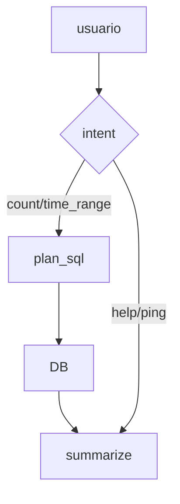

# Ejemplo 2 — Conversación usando consultas estructuradas en SQL

## Objetivo
Lograr que el usuario pueda ejecutar queries específicas sobre la base de datos mediante la interacción con OpenWebUI.

## Componentes
- OpenWebUI (frontend)
- OpenWebUI Pipelines
- Ollama: no aplica, esta pipeline solo se enfoca en procesar consultas en formato SQL
- PostgreSQL: sí
- LangGraph/LangChain: sí, el modelo basa su funcionamiento en nodos de langGraph

## Flujo de razonamiento (resumen)

